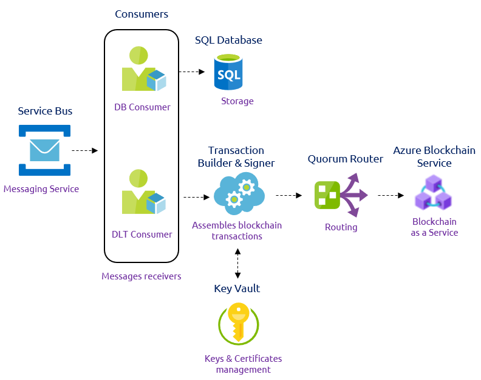

# Setting up a Sigfox Blockchain application with Microsoft Azure

## Introduction
Sigfox 0G network allows to collect unprecedent amount of data. However, we have seen that this data does not mean anything if not correctly used. It needs to be treated, refined, processed, correlated .. and once done in the appropriate way, it is then also bringing an unprecedent amount of value. That is why Sigfox-based successfull value propositions are never only about collecting the data but more importantly about creating value from it.

On the other hand, Blockchain has emerged in the past decades as one of the most incredible technology. 

Retail, Smart Insurance, Industry 4.0, Cold Chain Monitoring..

## Architecture

### 1. Writing to Microsoft Azure

Sigfox devices send some data over Sigfox 0G network. Then the Sigfox Cloud pushes it through a callback up to Microsoft Azure IoT Hub.

### 2. Prepare the data

Then, a suite of Azure services are being sollicited. First we use a Function App to parse the data into a Temperature and Humidity decimal values. It is then collected in a Service Bus that is responsible of routing it up to a Logic App. 

This Logic App has a simple objective: formatting the previously mentionned data into something that can be ingested by Azure Workbench Blockchain

### 3. Publish into the Blockchain

Two consumer services are listening for incoming messages into the previous service bus. The first one is a Database Consumer that will automatically push event informations into a simple SQL database.

The second one is a Data Ledger Technology Consumer responsible of forwarding the metadata for transactions to be written to the blockchain. Then the Transaction Builder & Signer assembles the blockchain transaction based on the related input data. Once assembled, the transaction is signed and delivered to Azure Blockchain Service through a specific router. Private keys are stored in Azure Key Vault.

### 4. Interact from WebApps

Azure Workbench Blockchain provides plug and play interaction tools such as a Client web app and a Smartphone app. They are connected to an Azure Active Directory for users and roles management. 

These web-services interact with a REST-based gatewayservice API. When writing to a blockchain, the API generates and delivers messages to an event broker. When data is requested by the API, queries are sent to the off-chain SQL database. The SQL database contains a replica of on-chain data and metadata that provides context and configuration information for supported smart contracts. Queries return the required data from the off-chain replica in a format informed by the metadata for the contract.

### Global architecture overview

## Concrete example

### Use-case introduction - Cold chain monitoring 

https://github.com/Azure-Samples/blockchain/blob/master/blockchain-workbench/application-and-smart-contract-samples/refrigerated-transportation/readme.md

https://github.com/Azure-Samples/blockchain/blob/master/blockchain-workbench/iot-integration-samples/ConfigureIoTDemo.md

### Implementation

#### 1. Writing to Microsoft Azure

The first step is to configure the Sigfox backend to push your device data up to an Azure IoT Hub.

A great tutorial regarding Sigfox data ingestion in Azure is available [here](https://medium.com/@nicolas.farolfi_48489/how-to-use-sigfox-with-microsoft-azure-c6ab6e1d1708).

It is about configuring Sigfox Backend Azure IoT Hub Callback to push the data generated by the Sens'it up to an Azure IoT Hub instance. Then we configure a Function App to parse the data from hexadecimal caracters into a usable data such as Temperature and Humidity decimal values. 

Note that once done, instead of pushing the data into an Event Hub we will chose instead to output it in a Service Bus.
Also, for later compatibility purposes, we will need to "Round" the temperature and humidity parsed values.

#### 2. Prepare the data

The next step is about being able to deliver the previous parsed data up to [Azure Blockchain Workbench](https://azure.microsoft.com/en-gb/features/blockchain-workbench/). It is basically a set of Azure services designed to help create and deploy blockchain applications. The goal is to be able to simplify and ease the development of such innovative applications, thus allowing to significantly accelerate the time to market of any blockchain related project. Also, since it is fully integrated in Azure, you will benefit of the cloud scalability and pay per use advantage.

A great tutorial released by Microsoft explains a way of doing so. It is available [here](https://github.com/Azure-Samples/blockchain/blob/master/blockchain-workbench/iot-integration-samples/ConfigureIoTDemo.md).
However, as before it needs to be adapted. 

