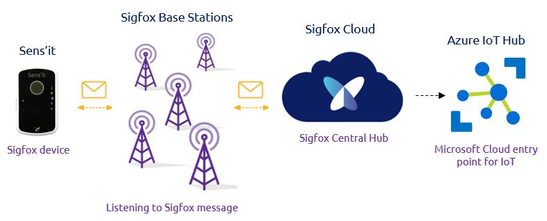

# Setting up a Sigfox Blockchain application with Microsoft Azure
# Enabling the power of IoT through Blockchain and Smart Contract. 

## Introduction
Sigfox 0G network allows to collect unprecedent amount of data. However, we have seen that this data does not mean anything if not correctly used. It needs to be treated, refined, processed, correlated .. and once done in the appropriate way, it is then also bringing an unprecedent amount of value. That is why Sigfox-based successfull value propositions are never only about collecting the data but more importantly about creating value from it.

On the other hand, Blockchain has emerged in the past decades as one of the most incredible technology. 
BLOCKCHAIN INTRO

Retail, Smart Insurance, Industry 4.0, Cold Chain Monitoring..

## Smart refrigerated transportation 
### Overview
EXPLAINING THE EXAMPLE
https://github.com/Azure-Samples/blockchain/blob/master/blockchain-workbench/application-and-smart-contract-samples/refrigerated-transportation/readme.md

https://github.com/Azure    -Samples/blockchain/blob/master/blockchain-workbench/iot-integration-samples/ConfigureIoTDemo.md

### Roles explanation

## Architecture

### Step by step architecture overview

Write into Azure

Format for blockchain ingestion

Publish into blockchain

Read from web

### Global architecture picture

The finale architecure is as follow:

### High level flow

#### Writing the data directly into Azure IoT Hub

### Collect and parse the raw data on Azure

The first step is to configure the Sigfox backend to push your device data up to an Azure IoT Hub.

A great tutorial regarding Sigfox data ingestion in Azure is available [here](https://medium.com/@nicolas.farolfi_48489/how-to-use-sigfox-with-microsoft-azure-c6ab6e1d1708).

It is about configuring Sigfox Backend Azure IoT Hub Callback to push the data generated by the Sens'it up to an Azure IoT Hub instance. Then we configure a Function App to parse the data from hexadecimal caracters into a usable data such as Temperature and Humidity decimal values. 

Note that once done, instead of pushing the data into an Event Hub we will chose instead to output it in a Service Bus.
Also, for later compatibility purposes, we will need to "Round" the temperature and humidity parsed values.

### Delivering Data from IoT Hub to Azure Blockchain Workbench

The next step is about being able to deliver the previous parsed data up to [Azure Blockchain Workbench](https://azure.microsoft.com/en-gb/features/blockchain-workbench/). It is basically a set of Azure services designed to help create and deploy blockchain applications. The goal is to be able to simplify and ease the development of such innovative applications, thus allowing to significantly accelerate the time to market of any blockchain related project. Also, since it is fully integrated in Azure, you will benefit of the cloud scalability and pay per use advantage.

A great tutorial released by Microsoft explains a way of doing so. It is available [here](https://github.com/Azure-Samples/blockchain/blob/master/blockchain-workbench/iot-integration-samples/ConfigureIoTDemo.md).
However, as before it needs to be adapted. 

