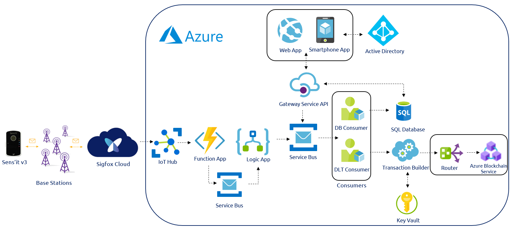

# [WIP] A Sigfox Smart Contract application with Microsoft Azure [WIP]

## Introduction
DRAFT [Sigfox 0G network allows to collect unprecedent amount of data. However, we have seen that this data does not mean anything if not correctly used. It needs to be treated, refined, processed, correlated .. and once done in the appropriate way, it is then also bringing an unprecedent amount of value. That is why Sigfox-based successfull value propositions are never only about collecting the data but more importantly about creating value from it.

On the other hand, Blockchain has emerged in the past decades as one of the most incredible technology. 

Retail, Smart Insurance, Industry 4.0, Cold Chain Monitoring..]

BENEFITS OF SMART CONTRACT AND BLOCKCHAIN

## Architecture

### Global architecture overview


1. Writing to Microsoft Azure


Sigfox devices send some data over Sigfox 0G network. Then the Sigfox Cloud pushes it through a callback up to Microsoft Azure IoT Hub.

2. Prepare the data


Then, a suite of Azure services are being sollicited. First we use a Function App to parse the data into a Temperature and Humidity decimal values. 

It is then collected in a Service Bus that is responsible of routing it up to a Logic App. 

This Logic App has a simple objective: formatting the previously mentionned data into something that can be ingested by Azure Workbench Blockchain

3. Publish into the Blockchain


Two consumer services are listening for incoming messages into the previous service bus. The first one is a Database Consumer that will automatically push event informations into a simple SQL database.

The second one is a Data Ledger Technology Consumer responsible of forwarding the metadata for transactions to be written to the blockchain. Then the Transaction Builder & Signer assembles the blockchain transaction based on the related input data. Once assembled, the transaction is signed and delivered to Azure Blockchain Service through a specific router. Private keys are stored in Azure Key Vault.

4. Interact from WebApps


Azure Workbench Blockchain provides plug and play interaction tools such as a Client web app and a Smartphone app. They are connected to an Azure Active Directory for users and roles management. 

These web-services interact with a REST-based gatewayservice API. When writing to a blockchain, the API generates and delivers messages to an event broker. When data is requested by the API, queries are sent to the off-chain SQL database. The SQL database contains a replica of on-chain data and metadata that provides context and configuration information for supported smart contracts. Queries return the required data from the off-chain replica in a format informed by the metadata for the contract.

## Demo

### Use-case introduction - Cold chain monitoring 

https://github.com/Azure-Samples/blockchain/blob/master/blockchain-workbench/application-and-smart-contract-samples/refrigerated-transportation/readme.md

https://github.com/Azure-Samples/blockchain/blob/master/blockchain-workbench/iot-integration-samples/ConfigureIoTDemo.md

### Implementation

#### Writing to Microsoft Azure

The first step is to configure the Sigfox backend to push your device data up to an Azure IoT Hub.

It is about configuring a Sigfox Backend Azure IoT Hub callback to push the data generated by the Sens'it up to an Azure IoT Hub 
instance.
A great tutorial regarding this Sigfox data ingestion in Azure is available [here](https://medium.com/@nicolas.farolfi_48489/how-to-use-sigfox-with-microsoft-azure-c6ab6e1d1708).
All credit to [Nicolas Farolfi](https://medium.com/@nicolas.farolfi_48489) for this tutorial. 

#### Prepare the data

1. Service Bus

Create a standard Service Bus and a Queue within this bus.

2. Function App

In this second step, we first need to configure a Function App to parse the data from hexadecimal caracters into understandable data such as Temperature and Humidity decimal values. 

Note that once done, instead of pushing the data into an Event Hub we will chose instead to output it in a Service Bus.
Also, in the interest of simplification, we will need to "Round" those decimal parsed values.

Create a *SensitV3Parser* Function App

Here below is an example of a parser written in Javascript. 

```javascript
module.exports = function (context, IoTHubMessages) {
    context.log(`JavaScript eventhub trigger function called for message array: ${IoTHubMessages}`);
    
    IoTHubMessages.forEach(message => {
        var payload,
            temperature,
            humidity,
            battery;

        payload = message.data;

        //temperture----------------------------------------
        // Calculate from payload
        var pay = payload.slice(3,6);
        var convertOfPayload = parseInt(pay,16);
        var mask = parseInt("001111111111",2);
        var x = convertOfPayload & mask;
        temperature = (x - 200) / 8;


        //humidity--------------------------------------------
        // Calculate from payload
        pay = payload.slice(6,8);
        convertOfPayload = parseInt(pay,16);
        var humidity = convertOfPayload / 2;

        //battery--------------------------------------------
        //Calculate from payload
        pay = payload.slice(0,2);
        convertOfPayload = parseInt(pay,16);
        mask = parseInt("11111000",2);
        x = convertOfPayload & mask;
        var battery = (x * 0.05) + 2.7;

        // create a well-formed object, to use in time series
        var obj = new Object();
        // date manipulation
        var today = new Date();

        obj.deviceId = message.device;
        obj.time = today.toISOString();
        obj.temperature = Math.round(temperature);
        obj.humidity = Math.round(humidity);
        obj.battery = battery;

        context.log(`Processed message: ${message}`);
        context.bindings.outputSbMsg = [];
        context.bindings.outputSbMsg.push(obj);

        context.log(JSON.stringify(context.bindings.outputSbMsg));
    });

    context.done();
};
```
From the integration tab, it is required to configure both inputs and outputs of your parser. Chose the queue previously created as an output of your FunctionApp


The next step is about being able to deliver the previous parsed data up to [Azure Blockchain Workbench](https://azure.microsoft.com/en-gb/features/blockchain-workbench/). 

A great tutorial released by Microsoft explains a way of doing so. It is available [here](https://github.com/Azure-Samples/blockchain/blob/master/blockchain-workbench/iot-integration-samples/ConfigureIoTDemo.md).
However, as before it needs to be adapted. 

3. Deploy an Azure Workbench Blockchain instance

Go to [Azure Workbench Blockchain > Deploy](https://docs.microsoft.com/en-gb/azure/blockchain/workbench/deploy) and follow the documentation.

4. Deploy the stored procedures

Prior to adding the newly-created message onto the Workbench Service Bus, the Logic App first makes a SQL call to the GetContractInstanceInfoForDeviceId Stored Procedure in the Workbench db.

This stored procedure takes a DeviceID as an input and returns the data for the specific contract instance that the device has been added to in Workbench with the "Device" role. (Each device can only be mapped to a single instance with this role.)

Once this message has been placed onto the Azure Blockchain Workbench Service Bus, it is picked up by Workbench and the appropriate actions(s) are taken to execute the request on the blockchain.

To load these stored procedures, go to the SQL database that has been deployed along with your Azure Workbench Blockchain instance, select the *Query Editor (preview)* and log in.

Download the sql procedure file [here](https://github.com/Azure-Samples/blockchain/blob/master/blockchain-workbench/iot-integration-samples/SQL/IoTSprocs.sql) and save it locally.

Finally you need to load it in Azure by selecting *Open query* and run it.

5. User creation

The external ID of the User table is used to hold the id of the device.

Add a user to Azure Blockchain Workbench that will represent your device using this [documentation](https://docs.microsoft.com/en-gb/azure/blockchain/workbench/manage-users).

Identify the device ID for your device that will be sent with the telemetry message.

In the query window, enter and execute the following SQL

Update [User] Set External Id = ‘ < your device id here >’ where EmailAddress = ‘< insert email address here >’

After creating a user to representing my Sens'it, I end up with this Active Directory user list:


6. Logic App

It is composed of 9 steps:


* Step 1


