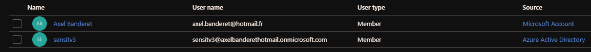
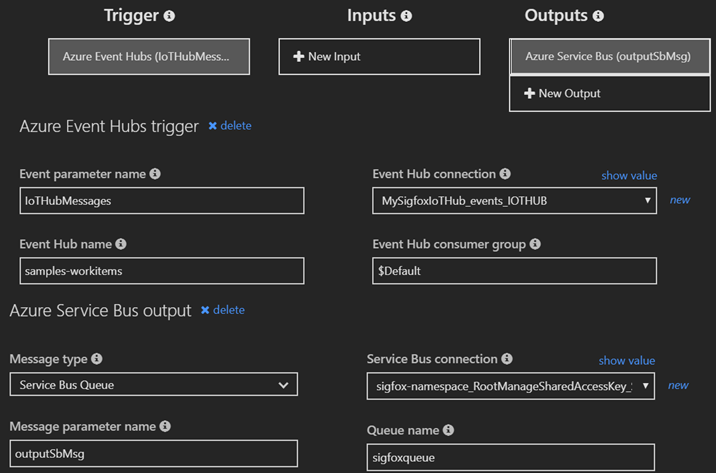

# A Sigfox IoT Blockchain application with Microsoft Azure 

## Objective
Following the growth of Blockchain and Smart Contract across multiple applications, I was curious to figure if we could leverage on their intrinsic benefits to optimize the use of collected IoT data. As a result, this article presents a Blockchain based demo application fed by a Sigfox IoT device that triggers Smart Contract related actions on Microsoft Azure.

## Introduction
Sigfox 0G network allows to collect unprecedented amount of data from wide types of sources that were not possible to connect so far. However, this huge amount of information does not reveal a relevant value unless it is analysed and processed in a proper way. Once correctly handled, this extracted data reveals an unexpected amount of value. This is the power of IoT and this is also why Sigfox-based value propositions are never only about collecting the data but more importantly about creating value out of it.

On the other hand, Blockchain has emerged in the past decade as one of the most useful and democratized technology. So many applications in multitude of verticals are now adopting it. To quickly recap, a Blockchain is a series of blocks of information linked by cryptographic hashes which are distributed across a network of nodes. Each of them has a local copy of the blockchain and verifies the new blocks by reaching an agreed consensus. Hence, the Blockchain becomes a public distributed ledger of information which is inherently immutable, transparent and secure. This is how it defines a new way of storing and exchanging information.

Following this growth potential, several edge technologies have been developed on top of the Blockchain. Smart Contracts are one of those. The concept is basically to pre-define logical rules and actions that will be triggered depending on the data processed within the Blockchain. Among others, it allows us to use the Blockchain data as an input and define modular, automatic, instantaneous and administrative-free actions based on it.

## Architecture

The global flow overview is the following:


### 1. Writing to Microsoft Azure


The Sigfox Sens'it sends some data over Sigfox 0G network. Then the Sigfox Cloud pushes it through a callback up to Microsoft Azure IoT Hub.

### 2. Prepare the data


A suite of Azure services are then being sollicited. First we use a Function App to parse the data into Temperature and Humidity decimal values. 

It is then collected in a Service Bus that is responsible of routing it up to a Logic App. 

This Logic App has a simple objective: formatting the previously mentionned data into something that can be ingested by Azure Workbench Blockchain

### 3. Publish into the Blockchain


Two consumer services are listening for incoming messages into the previous service bus. The first one is a Database Consumer that will automatically push event informations into a simple SQL database.

The second one is a Data Ledger Technology Consumer responsible of forwarding the metadata for transactions to be written to the blockchain. The Transaction Builder & Signer assembles the blockchain transactions based on the related input data. Once assembled, every transaction is signed and delivered to Azure Blockchain Service through a specific router. Private keys are stored in Azure Key Vault.

### 4. Interact from WebApps


Azure Workbench Blockchain provides plug and play interaction tools such as a Client web app and a Smartphone app. They are connected to an Azure Active Directory for users and roles management. 

These web-services interact with a REST-based gateway service API. When writing to a blockchain, the API generates and delivers messages to an event broker. When some data is requested by the API, queries are sent to the SQL database. This storage contains a replica of overall data and metadata that provides configuration and context information about the related smart contracts. Queries return the requested data from this "off-chain" replica in a format which has been specified by the smart contract.

### Demo Setup

For this demo, we will be using a ready-to-use Smart Contract provided by Microsoft. It is linked to an "IoT Refrigerated Transportation use-case". I would strongly advise to read the documentation available [here](https://github.com/Azure-Samples/blockchain/blob/master/blockchain-workbench/application-and-smart-contract-samples/refrigerated-transportation/readme.md) before going further. Here is the summary overview: 

**«** *The refrigerated transportation smart contract covers a provenance scenario with IoT monitoring. You can think of it as a supply chain transport scenario where certain compliance rules must be met throughout the duration of the transportation process. The initiating counterparty specifies the humidity and temperature range the measurement must fall in to be compliant. At any point, if the device takes a temperature or humidity measurement that is out of range, the contract state will be updated to indicate that it is out of compliance.* **»** 

### 1. Interfacing Azure with the Sigfox Cloud

The first step is to configure the Sigfox backend to push your device data up to an Azure IoT Hub.

It is about configuring a Sigfox Backend Azure IoT Hub callback to push the data generated by the Sens'it up to an Azure IoT Hub 
instance.
A great tutorial regarding this Sigfox data ingestion in Azure is available [here](https://medium.com/@nicolas.farolfi_48489/how-to-use-sigfox-with-microsoft-azure-c6ab6e1d1708).
All credits to [Nicolas Farolfi](https://medium.com/@nicolas.farolfi_48489) for this tutorial. 

### 2. Blockchain set-up

#### 1. Deploy Azure Workbench Blockchain

Go to [Azure Workbench Blockchain > Deploy](https://docs.microsoft.com/en-gb/azure/blockchain/workbench/deploy) and follow the documentation.

#### 2. Active Directory configuration: User management

The external ID of the User table is used to hold the id of the device.

Add a user to Azure Blockchain Workbench that will represent your device using this [documentation](https://docs.microsoft.com/en-gb/azure/blockchain/workbench/manage-users).

After creating a user to representing my Sens'it, I end up with this Active Directory user list:



Identify the device ID from the device that will be sending telemetry messages, then go to your Azure SQL database.

In the query window, enter and execute the following SQL

Update [User] Set External Id = ‘ < your device id here >’ where EmailAddress = ‘< insert email address here >’

### 3. Data formatting 

#### 1. Service Bus

Create a standard Service Bus and a Queue within this bus.

#### 2. Function App: Parsing the raw data

In this second step, we first need to configure a Function App to parse the data from hexadecimal string into understandable data such as Temperature and Humidity decimal values. 

Note that once done, instead of pushing the data into an Event Hub we will chose instead to output it in a Service Bus.
Also, in the interest of simplification/integration, we will need to "Round" those decimal parsed values.

Create a *SensitV3Parser* Function App

Here below is an example of a parser written in Javascript. 

```javascript
module.exports = function (context, IoTHubMessages) {
    context.log(`JavaScript eventhub trigger function called for message array: ${IoTHubMessages}`);
    
    IoTHubMessages.forEach(message => {
        var payload,
            temperature,
            humidity,
            battery;

        payload = message.data;

        //temperture----------------------------------------
        // Calculate from payload
        var pay = payload.slice(3,6);
        var convertOfPayload = parseInt(pay,16);
        var mask = parseInt("001111111111",2);
        var x = convertOfPayload & mask;
        temperature = (x - 200) / 8;


        //humidity--------------------------------------------
        // Calculate from payload
        pay = payload.slice(6,8);
        convertOfPayload = parseInt(pay,16);
        var humidity = convertOfPayload / 2;

        //battery--------------------------------------------
        //Calculate from payload
        pay = payload.slice(0,2);
        convertOfPayload = parseInt(pay,16);
        mask = parseInt("11111000",2);
        x = convertOfPayload & mask;
        var battery = (x * 0.05) + 2.7;

        // create a well-formed object, to use in time series
        var obj = new Object();
        // date manipulation
        var today = new Date();

        obj.deviceId = message.device;
        obj.time = today.toISOString();
        obj.temperature = Math.round(temperature);
        obj.humidity = Math.round(humidity);
        obj.battery = battery;

        context.log(`Processed message: ${message}`);
        context.bindings.outputSbMsg = [];
        context.bindings.outputSbMsg.push(obj);

        context.log(JSON.stringify(context.bindings.outputSbMsg));
    });

    context.done();
};
```
From the integration tab, it is required to configure both inputs and outputs of your parser. Chose the queue previously created as an output of your FunctionApp



The next step is about being able to deliver the previous parsed data up to [Azure Blockchain Workbench](https://azure.microsoft.com/en-gb/features/blockchain-workbench/). 

A great tutorial released by Microsoft explains a way of doing so. It is available [here](https://github.com/Azure-Samples/blockchain/blob/master/blockchain-workbench/iot-integration-samples/ConfigureIoTDemo.md).
However, as before it needs to be adapted. 

#### 3. Deploy the stored procedures

Prior to adding the newly-created message onto the Workbench Service Bus, the Logic App first makes a SQL call to the GetContractInstanceInfoForDeviceId Stored Procedure in the Workbench db.

This stored procedure takes a DeviceID as an input and returns the data for the specific contract instance that the device has been added to in Workbench with the "Device" role. (Each device can only be mapped to a single instance with this role.)

Once this message has been placed onto the Azure Blockchain Workbench Service Bus, it is picked up by Workbench and the appropriate actions(s) are taken to execute the request on the blockchain.

To load these stored procedures, go to the SQL database that has been deployed along with your Azure Workbench Blockchain instance, select the *Query Editor (preview)* and log in.

Download the sql procedure file [here](https://github.com/Azure-Samples/blockchain/blob/master/blockchain-workbench/iot-integration-samples/SQL/IoTSprocs.sql) and save it locally.

Finally you need to load it in Azure by selecting *Open query* and run it.

#### 5. Logic App

It is composed of 9 steps:


* Step 1

The logic app will scan the queue for new incoming messages every second. 


* Step 2

Select **Parse JSON** action. The content needs to be converted from Base64 to String. Click in the content field, select Expression and enter the following: ```json(base64ToString(triggerBody()?['ContentData']))```

For the schema property, we need to enter the one corresponding to the Sens'it in Temperature & Humidity mode:

```json
{
    "properties": {
        "battery": {
            "type": "number"
        },
        "deviceId": {
            "type": "string"
        },
        "humidity": {
            "type": "number"
        },
        "temperature": {
            "type": "number"
        },
        "time": {
            "type": "string"
        }
    },
    "type": "object"
}
```


* Step 3

Select **SQL Stored Procedure**. Configure the connection to the corresponding Azure Workbench SQL Database and then chose the stored procedure named *GetContractInfoForDeviceID*.

Using Dynamic Properties, select *deviceId*


* Step 4

Select **Parse JSON** action. Click in the *Content field* and then select the *ResultSets* item for content. The schema is here below:

```json
{
    "properties": {
        "Table1": {
            "items": {
                "properties": {
                    "ConnectionId": {
                        "type": "number"
                    },
                    "ContractCodeBlobStorageUrl": {
                        "type": "string"
                    },
                    "ContractId": {
                        "type": "number"
                    },
                    "ContractLedgerIdentifier": {
                        "type": "string"
                    },
                    "IngestTelemetry_ContractPersonaID": {},
                    "IngestTelemetry_ContractWorkflowFunctionID": {
                        "type": "number"
                    },
                    "IngestTelemetry_Humidity_WorkflowFunctionParameterID": {
                        "type": "number"
                    },
                    "IngestTelemetry_Temperature_WorkflowFunctionParameterID": {
                        "type": "number"
                    },
                    "IngestTelemetry_Timestamp_WorkflowFunctionParameterID": {
                        "type": "number"
                    },
                    "UserChainIdentifier": {
                        "type": "string"
                    },
                    "WorkflowFunctionId": {
                        "type": "number"
                    },
                    "WorkflowFunctionName": {
                        "type": "string"
                    },
                    "WorkflowName": {
                        "type": "string"
                    }
                },
                "required": [
                    "ContractId",
                    "WorkflowFunctionId",
                    "ConnectionId",
                    "ContractLedgerIdentifier",
                    "ContractCodeBlobStorageUrl",
                    "UserChainIdentifier",
                    "WorkflowFunctionName",
                    "WorkflowName",
                    "IngestTelemetry_ContractWorkflowFunctionID",
                    "IngestTelemetry_ContractPersonaID",
                    "IngestTelemetry_Humidity_WorkflowFunctionParameterID",
                    "IngestTelemetry_Temperature_WorkflowFunctionParameterID",
                    "IngestTelemetry_Timestamp_WorkflowFunctionParameterID"
                ],
                "type": "object"
            },
            "type": "array"
        }
    },
    "type": "object"
}
```


* Step 5

Select **Initialize variable** action. This new variable will be used to specify a unique id for the request. This can be useful for monitoring purposes later on.

Set the Name property to *RequestId*.

Set the Type property to *String*.

In the Value property, use the Dynamic Content window, select Expression and enter: ```guid()```


* Step 6

Select **Initialize variable** action. This new variable will be used to define the Unix Epoch time to include as the timestamp for every new message.

Set the Name property to *TicksNow*.

Set the Type property to *Integer*.

Click on the Value property field and then in the Dynamic Content window enter the following in the Expression tab: ```ticks(utcNow())``` 


* Step 7

Select **Initialize variable** action. This variable will be used for defining the Unix Epoch time as well.

Set the Name property to *TicksTo1970*.

Set the Type property to *Integer*.

Click on the Value property field and then in the Dynamic Content window enter the following in the Expression tab: ```ticks('1970-01-01')``` 


* Step 8

Select **Initialize variable** action.

Set the Name property to *Timestamp*.

Set the Type property to *Integer*.

Click on the Value property field and then in the Dynamic Content window enter the following in the Expression tab: ```div(sub(variables('TicksNow'),variables('TicksTo1970')),10000000)``` 


* Step 9

Select **For each** action.

In the field called "Select an output from previous steps property", select *Table1* from Dynamic Content list. 

Then configure the action to send a message into your Worbench Blockchain associated input service bus. Configure the connection relatively:
Set the "ueue/Topic name" to *ingressQueue*.

Set the "SessionId" to *RequestId*.

Then the Content property can be filled with the template below:

```
{
    "requestId": "@{variables('RequestId')}",
    "userChainIdentifier": "@{items('For_each')?['UserChainIdentifier']}",
    "contractLedgerIdentifier": "@{items('For_each')?['ContractLedgerIdentifier']}",
    "workflowFunctionName": "IngestTelemetry",
    "Parameters": [
        {
            "name": "humidity",
            "value": "@{body('Parse_JSON')?['humidity']}"
        },
        {
            "name": "temperature",
            "value": "@{body('Parse_JSON')?['temperature']}"
        },
        {
            "name": "timestamp",
            "value": ""
        }
    ],
    "connectionId": @{items('For_each')?['ConnectionId']},
    "messageSchemaVersion": "1.0.0",
    "messageName": "CreateContractActionRequest"
}
``` 


## Demo 

### Deploy the Blockchain application example

At this point, you are now able to interact with your system through the GUI.
In your Azure deployed resources, select the App Service and click on the given URL. 

We land on a web page where we will be able to create and deploy a Blockchain application. Just upload the .json and .sol files corresponding to Refrigereated Transportation Example provided [here](https://github.com/Azure-Samples/blockchain/blob/master/blockchain-workbench/application-and-smart-contract-samples/refrigerated-transportation/readme.md) by Microsoft. It should be interesting to deep-dive into those Smart Contract files because they are the one defining how the Blockchain application is going to behave. Using and writing such files might be required to create your own Blockhain Application. 


### Add Users

To add new members, make sure to log in as an application administrator. You will then be able to assign members to roles .i.e **InitiatingCounterParty**, **Counterparty**, **Device** (that represents the Sens'it), **Owner** or **Observer**. 


### Create a Smart Contract instance

We can now create a new Contract by assigning accounts to roles and define threshold values to be applied.


### Interacting with the application

Here is the general dashboard we land on:


In this demo, the related Smart Contract enforces specific rules related to conditions during transport. Specifically, receiving and evaluating temperature and humidity data against an agreed upon acceptable range. If the Smart Contract identifies that the telemetry is out of the range, it will immutably shift into an OutOfCompliance state and appropriate remedies will be sought.

By default, the contract starts in the Created state. Then, as it transits through each intermediary of the chain, it will shift in In Transit state and finally ends up in Completed. 

In the happy path, the device sends readings, which are in compliance throughout the transportation process, while the involved counterparties transfer responsibility until the transportation is completed.

Let’s present the solution through an example. A pharmaceutical company “Vital Pharma” requires to ship their product including vaccins to hundreds of pharmacies across Europe. Since those products require a strong integrity management and conditions monitoring, Vital Pharma is partnering with a highly reliable delivery company “deliver.it” specialized in the shipment of such products. 

In order to prove its reliability, deliver.it guarantees a full refund of the amount of the shipment if the pre-defined rules are not respected. At the end of the chain, the pharmacist “Joe Bloggs” will confirm the reception of the package. All those users are listed into an Azure Active Directory instance which makes it easy to manage.


Every counterparty can log on the WebApp to follow the shipment and Take Action. Here we log in as VitalPharma and define the smart contract:


The shipment appears as Created:


Once the shipment is handled by deliver.it, VitalPharma is able to legitimately transfer the responsibility:


When logging in with deliver.it account, it appears we are now responsible for the shipment. And the same process will continue until shipment is accepted by the last element of the chain.


Now the nteresting part:If the IoT devices measures for instance an out of rage temperature, here is what happens:


And the detail of the incident:


With the related measured values from the Sens'it:


Some automatic alerts and remedies can also be set up as follow:


Also, the whole WebApp is API-based which makes it easy to integrate with any platform/middleware:


It is also possible to visualise the data in Microsoft Power Bi as shown in this example from Microsoft:


## Conclusion

IoT and Blockchain can be an interesting mix for so many verticals: Insurance 4.0, Supply Chain, Retail.. Also, this is a private blockchain example but we would imagine further applications based on public decentralized blockchains and their corresponding tokens. 

## Sources

+ https://github.com/Azure-Samples/blockchain/blob/master/blockchain-workbench/iot-integration-samples/ConfigureIoTDemo.md

+ https://github.com/Azure-Samples/blockchain
